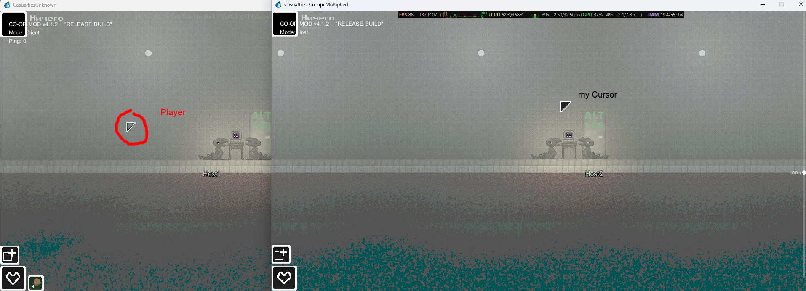

# MultiPlayerCursor

A mod for **Casualties Unknown** that displays the in-world cursors of other players in a multiplayer session. This helps you see where your teammates are looking and pointing.

## Features

- Displays a cursor for every other player connected to the multiplayer session.
- Hides a player's cursor if they have tabbed out or died.
- In non-team PvP, hides opponents' cursors; in team PvP, displays cursors only for players on your team.
- Automatically creates cursors after joining a session and during gameplay.
- Shows description boxes of objects players are hovering on.
- Has a hotkey to disable the mod (F2).

## Requirements

- The latest version of BepInEx
- [Multiplayer mode](https://github.com/creaturefeaturelarry/casualties-together)

## Installation

1. Install BepInEx for Casualties Unknown and launch the game once.
2. Make sure the [Multiplayer mode](https://github.com/creaturefeaturelarry/casualties-together) mod is installed.
3. Copy `OnlineCursor.dll` into the `BepInEx/plugins/OnlineCursor` folder in the game directory.
4. Start or join a multiplayer session.

The mod works only while the multiplayer system is running.
